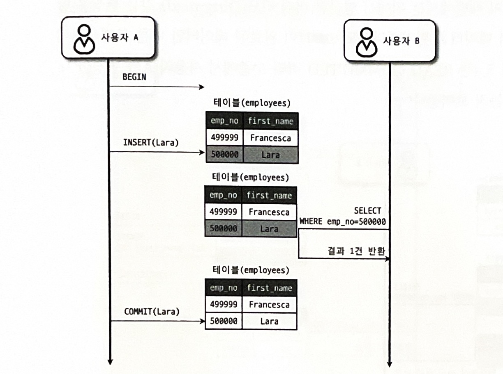

# `트랜잭션`

---
## 개요
트랜잭션은 일련의 작업들을 모두 처리하거나, 하나라도 문제가 발생할 경우 처리하기 이전으로 
복구하는 기능을 말한다. SQL에서의 INSERT, SELECT, UPDATE 작업의 정합성을 유지하는데 사용하는 기능이다.

---

## `트랜잭션의 ACID`

트랜잭션의 4가지 성질인 원자성, 일관성, 격리성, 지속성에 대해 알아보자.

### 원자성 (Atomicity)
트랜잭션의 작업을 쪼개어질 수 없는 원자로 보는 것.
즉, 작업 단위 전체가 모두 반영되거나, 반영되지 않는 특징을 말한다.

### 일관성 (Consistency)
트랜잭션 작업이 논리적으로 옳은 상태를 보장해야한다. 
예를 들어서 은행 내의 총 10만원의 돈이 있다고 해보자. 은행 프로그램에서 A의 계좌에서 10만원을 출금해서 B의 계좌에 100원을 입금한다고 할 때,

1. A의 계좌에서 10만원 출금
2. B의 계좌에 10만원 입금 

이때, 1 만 수행되고, 2번이 실패한다면, A의 돈 10만원은 
없어져버리는 문제가 발생한다. 이처럼 우리가 정의한 규칙이 깨지지 않도록
유지해야한다.

### 격리성 (Isolation)
둘 이상의 트랜잭션이 동시에 실행될 때, 하나의 트랜잭션 작업에
다른 트랜잭션이 끼어들 수 없는 것을 의미.
즉, 각각의 트랜잭션 작업은 독립적으로 연산되어야 하는 특성이다.

이를 MySQL에서 격리수준(Isolation level)을 통해서 격리성의 강도를
설정할 수 있다.

### 지속성 (Durability)
트랜잭션이 성공했을 경우, 결과를 영구적으로 반영해야한다는 속성.

---

## MySQL에서 트랜잭션 사용법

우선 기본 세팅을 한다.
```mysql
SET AUTOCOMMIT=0;
```
MySQL은 쿼리를 자동으로 커밋하는데, 이를 꺼줘야한다.

```mysql
# 트랜잭션의 시작을 의미. COMMIT 전까지를 하나의 작업단위로 인식한다.
START TRANSACTION;

# SELECT ...;
# UPDATE ... ;
# DELETE ... ;

# 트랜잭션 작업 내용을 DB 에 반영한다.
COMMIT;


```
`transaction + commit`
```mysql
# 트랜잭션의 시작을 의미. COMMIT 전까지를 하나의 작업단위로 인식한다.
START TRANSACTION;

# SELECT ...;
# UPDATE ... ;
# DELETE ... ;
    
# DB를 트랜잭션 시작 전으로 되돌린다.
ROLLBACK; 
```

`transaction + rollback`

---

## Rollback 과 언두 로드

롤백을 하기 위해서는 작업하기 전의 데이터를 별도로 보관되어 있어야한다.
MySQL의 InnoDB에서는 이를 위해서 `언두로그` 기능이 내재되어있다. 
이 언두 영역에는 INSERT, UPDATE, DELETE와 같은 쿼리로 데이터를 변경하지 전에 데이터를 백업해 놓는다.
이 언두로그는 다음 작업에 사용된다.

- 격리 수준 보장
- 트랜잭션 롤백

---

## `격리성 레벨`

트랜잭션의 격리 수준은 여러 트랜잭션이 동시에 처리될 때, 특정 트랜잭션이 
다른 트랜잭션에서 변경하거나 조회하는 데이터를 볼 수 있게 허용할지 말지를 결정하는 것이다.
총 4가지 수준이 있다.
- READ UNCOMMITED
- READ COMMITTED
- REPEATABLE READ
- SERIALIZABLE

| 격리 수준 (Isolation Level) | Dirty Read | Non-repeatable Read | Phantom Read      |
| ----------------------- |------------|-----------------|-------------------|
| **READ UNCOMMITTED**    | 발생         | 발생              | 발생                |
| **READ COMMITTED**      | 없음         | 발생              | 발생                |
| **REPEATABLE READ**     | 없음         | 없음              | 발생 *(InnoDB은 없음)* |
| **SERIALIZABLE**        | 없음         | 없음              | 없음                |


### READ UNCOMMITTED
READ UNCOMMITTED는 가장 낮은 격리성 레벨이다.
트랜잭션 내부 작업을 커밋하기 전에도
외부 트랜잭션에서 데이터를 읽을 수 있다. 


사용자 A가 Lara를 INSERT하였는데, COMMIT하기 전에 사용자 B가
Lara라는 데이터를 조회할 수 있다. 
만약 A의 작업이 ROLLBACK이 되었다면, 사용자 B는 실제로 존재하지 않는 Lara 데이터를
읽고 처리하게 되는 문제가 발생할 수 있다. 이를 `Dirty READ` 현상이라고 하는데, 
데이터 정합성에 큰 문제를 일으킬 수 있다.


정확하지 않아도 되는, 단순하게 빨리 읽는 작업에서만 사용한다.

하지만 대부분의 경우에는 문제가 발생하므로 READ COMMITTED 레벨 이상을 사용하는 것을 추천한다.


### READ COMMITTED

다른 트랜잭션에서 COMMIT된 데이터만 조회할 수 있는 격리성 레벨이다. 따라서 Dirty Read 현상이 발생하지 않는다.

사용자 A, 사용자 B가 작업을 한다고 할때, 
사용자 A가 데이터를 변경하는 작업을 할때, `언두 로그`에 이전 데이터를 저장한다.

사용자 B는 `언두 로그`에 있는 변경 전 데이터를 참조하여 작업을 처리한다.

UPDATE Lara를 한다고 해보자.
1. 사용자 A가 Lara의 이름을 Toto로 UPDATE 하였다. 이와 동시에 언두로그에 Lara 데이터가 백업된다.
2. 사용자 B가 Lara를 SELECT로 조회한다.
   -> B는 A가 작업한 Toto를 읽지 않고, 언두로그에 저장된 Lara를 조회한다.

이와같이 언두로그를 통해서 더티리드를 방지한다.

하지만 `READ COMMITTED`는 NON REPEATABLE READ 라는 문제가 발생할 수 있다.
이는 하나의 트랜잭션 내에서 동일한 데이터의 조회 시점에 따라서 값이 다르게 읽힐 수 있는 문제인데 다음 예시를 보자.
(각각 다른 트랜잭션에서 작업하는 예시이다)
1. 사용자 B가 Toto라는 데이터를 조회한다.
   -> 이때 Toto라는 데이터는 존재하지 않는다.
2. 사용자 A가 Toto라는 데이터를 INSERT 한다.
3. 사용자 A가 COMMIT하여 트랜잭션을 끝낸다.
4. 사용자 B가 Toto라는 데이터를 조회한다. 
   -> 이때 사용자 A가 COMMIT한 Toto라는 데이터가 조회된다.

이렇게 하나의 트랜잭션에서 동일하게 조회했을 때, 다른 결과가 나오는 문제가 발생하고 
이로 인해 데이터의 정합성이 깨지는 문제가 생기게 된다.

### REPEATABLE READ

MySQL에서 기본값으로 사용되는 격리 수준이다.
하나의 트랜잭션에서 동일한 조회값을 보장하는 격리 수준이다.

1. 사용자 B가 Toto라는 데이터를 조회한다.
   -> 이때 Toto라는 데이터는 존재하지 않는다.
2. 사용자 A가 Toto라는 데이터를 INSERT 한다.
3. 사용자 A가 COMMIT하여 트랜잭션을 끝낸다.
4. 사용자 B가 Toto라는 데이터를 조회한다.
   -> 이때 Toto라는 데이터는 여전히 존재하지 않는다.

`어떻게 이런 기능이 가능할까?`

InnoDB에는 MVCC를 통해 트랜잭션 시작 시점에서의 데이터를 미리 가져와서 저장해놓는다.
그리고 해당 트랜잭션에서는 실제 DB의 데이터를 참조하는 것이 아닌, 미리 가져온 데이터만 참조하여 
조회시 일관성을 보장할 수 있다.

위 예에서 구체적으로 설명해보면,

0. 사용자 B가 트랜잭션을 시작할 때, 현재 DB에 데이터 `스냅샷`을 가져온다. (현재 DB 데이터 백업본) 
1. 사용자 B가 `스냅샷`에서 Toto라는 데이터를 조회한다.
   -> 이때 Toto라는 데이터는 존재하지 않는다.
2. 사용자 A가 Toto라는 데이터를 INSERT 한다.
3. 사용자 A가 COMMIT하여 트랜잭션을 끝낸다.
4. 사용자 B가 `스냅샷`에서 Toto라는 데이터를 조회한다.
   -> 이때 Toto라는 데이터는 여전히 존재하지 않는다.


정확히는 현재 DB의 스냅샷이라고 표현하기엔 부적합하지만, 문제가 없을 정도 수준의 데이터를 가져온다고 생각하면 된다.

하지만 REPEATABLE READ 또한 문제가 존재한다.

`팬텀리드`라고 하는 것인데, 데이터를 UPDATE하는 경우에는 정합성을 보장하지만,
INSERT하는 경우에는 보장하지 못한다. `스냅샷`은 기존 행의 "버전"만 보는 거지, 나중에 들어온 새로운 데이터는 필터링하지 못한다.

하지만 MySQL은 `갭 락`을 통해 데이터의 삽입을 막아서 팬텀리드가 발생하지 않는다.

### SERIALIZABLE

가장 엄격한 격리 수준으로, 트랜잭션이 작업하고 있는 레코드를 락으로 잠궈, 다른 트랜잭션에서 읽기 + 쓰기를 막아버린다. 
즉, 해당 작업이 끝나고 나서 다른 트랜잭션이 작업하는 하나하나 처리해나가는 방식이다.
하지만 이 격리성 수준은 성능이 많이 떨어져서 사용하지 않는다.