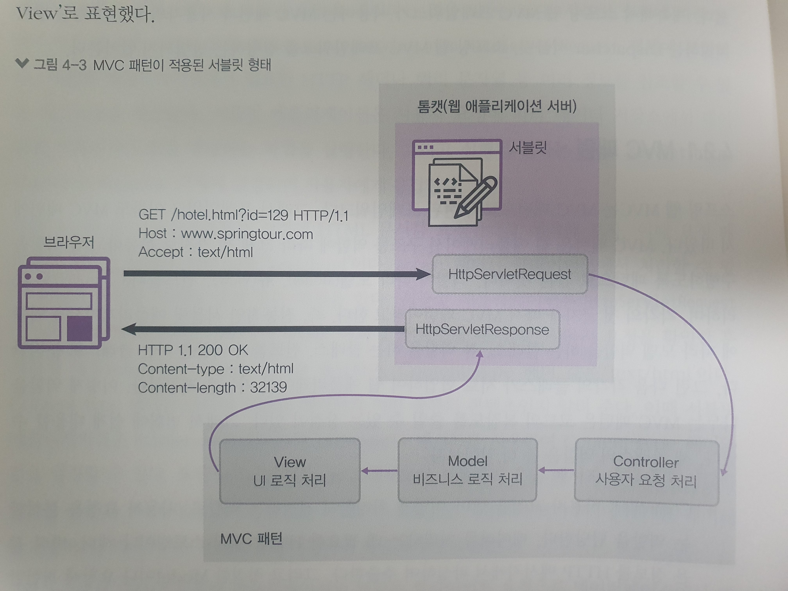
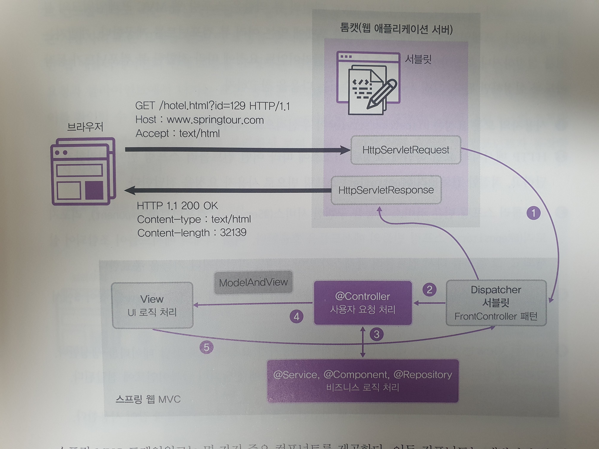
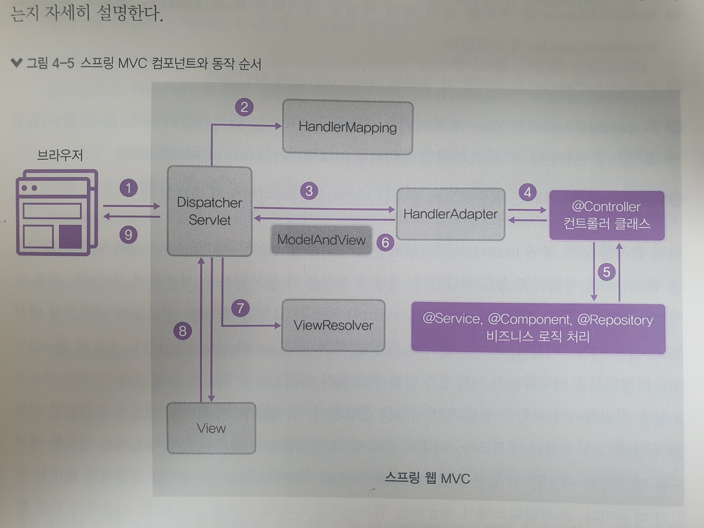

# `3. Spring Web MVC 프레임 워크`

---

# 개요

### 스프링의 서블릿 컨테이너
WEB 환경에서는 `HTTP` 통신을 많이 사용한다. Spring 또한 이러한 HTTP 요청을 처리하는 수단을 가지고 있는데
이를 `서블렛(servlet)`이라고 한다. 이러한 서블릿을 관리하고 실행하는 서버를 `서블릿 컨테이너` 혹은 `WAS`라고 하는데
Spring에서는 `TOMCAT`이라는 WAS를 사용한다.

## servlet
`servlet`은 HTTP 요청에 같이 들어오는 헤더, 페이로드 등의 값들을 확인하여 처리하고, 응답을 만들어서 클라리언트에게 반환한다.
이러한 과정을 코드로 작성하고 관리하기는 매우 번거로운데, Spring 웹은 `MVC 패턴`을 사용하여 이를 단순하게 만들었다.

이제 본격적으로 `MVC 패턴`과 `Dispatcher Servlet` 에 대해서 알아보자.

---

# `MVC 패턴`
MVC 패턴이란, 웹 APP의 구조를 역할에 따라서 3가지로 분류하여 작성한 패턴이다. MVC는 다음과 같다.
- Model : 전달 받은 데이터를 가공, 처리하는 역할 
- View : 사용자에게 전달하는 응답 형태를 결정하고 Model 데이터를 JSON, XML 등으로 전달하는 역할 
- Controller : 사용자가 보낸 요청 데이터를 파싱하고 추출하는 역할. 이 데이터를 Modle, View에 전달한다.

위와같이 웹 APP 코드를 구현하는 단계에서 MVC와 같이 분리하면, 전처리 / 비즈니스 로직 / 응답 을 확실하게
나누어 코드를 작성할 수 있다.

이 패턴을 그림으로 표현하면 위와 같이 나타낼 수 있다.

여기에서 조금 더 나아가서, `Spring Bean`과 `Spring MVC 프레임 워크`를 추가하면 다음과 같이 표현할 수 있다.

Spring Boot 에서 `Dispatcher Servlet`, `View` 로직은 기본적으로 이미 구현이 되어있다.
즉, HTTP 요청으로 들어오는 헤더, 페이로드들을 추출하는 기능과 JSON, HTML 응답으로 반환하는 기능이 내재되어 있다는 뜻이다.

따라서 Spring Boot 개발자는 보라색으로 표시된 부분인 `Controller`, `비즈니스로직`들만 구현하면 웬만한 WEB APP은 모두 구현할 수 있다. 
Spring 코드는 대부분 위 패턴을 따르는데, 익숙해진 나머지 이게 얼마나 편리한 지를 잊어버리는... 느낌이 종종 온다.
HTTP 요청을 파싱하는 작업, JSON으로 변환하는 작업... 이 모든 것들을 제공해준다.

위 그림에 대해 간단하게 설명하면 아래와 같다.
1. 요청 처리
2. HTTP 메시지를 분석해서 어떤 `Controller`에 전달할지를 판단하고, Bean을 통해 해당 Controller에 주입한다.
3. 받은 데이터 처리 및 가공
4. 처리된 데이터를 ModelAndView객체를 이용하여 전달
5. 전달받은 데이터를 맵핑하여 응답 데이터 생성하고, Dispathcer Servlet에 전달

이제 각각의 과정이 어떻게 일어나는지를 실제 `Component`들을 통해서 이해해보자.

---
# `MVC 컴포넌트`

각 컴포넌트의 기능을 정리하면 아래와 같다.

**(그림에 있는 숫자랑 다르므로 주의할 것)**

### 1. Dispatcher Servlet
Spring에서 Dispatcher Servlet은 입구와 출구같은 역할을 한다.
사용자의 모든 요청이 들어가고, 전송하는 모든 응답이 이 컴포넌트를 거친다.

HTTP 데이터를 받아서, 헤더 요청라인을 파악한다.

### 2. HandlerMapping
Dispatcher Servlet 에서 전달해주는 헤더/요청라인 정보를 통해 어떤 Controller 메서드로 전달할지를 확인한다.

Spring App 실행시에, `@RequestMapping` 애너테이션 정보를 로딩하여 `RequestMappingHandlerMapping`에 저장시킨다.
그리고 저장된 정보를 `DispatcherServlet`이 getHandler()를 통해 얻어 `HandlerMapping`에서 요청을 어떤 Controller로 보내야할지를 알아낸다.

### 3. HandlerAdapter
`Object Adapter`의 역할을 수행한다. 어댑터란, 서로 호환되지 않는 객체들을 호환되는 객체로 변환해주는 역할을 담당한다.
Servlet 데이터를 Controller에서 받을 수 있도록 변환해준다.

### 4. @Controller, @Component
우리가 처리해야 할 비즈니스 로직을 넣어서, 데이터를 처리하고 저장한다.
스테레오 타입 애너테이션으로 처리된 것들에서 로직 처리를 진행한다.

### 5. ModelAndViewㅎ
처리할 View와 View에 맵핑할 데이터를 담는 객체이다. 
`HandlerMapping`이 ModelAndView 객체로 변환하여 서블릿으로 전달한다.

### 6. ViewResolver
문자열 기반의 View를 실제 View 구현체로 변환한다.

### 7. View
받은 데이터를 `HTML, XML, JSON 등으로 변환`하여 서블릿으로 전달한다.

위에서 보면 모든 요청과 모든 응답을 `DispatcherServlet`을 거쳐서 처리하는데, 이 점을 이용하여
받는 데이터의 인증/인가 요청을 쉽게 처리할 수 있다. 일종의 수문장을 넣어 인증/인가된 데이터인지 확인하는 로직을 구현할 수 있는데
이러한 방식으로 구현된 것이 `Spring Security`이다.
