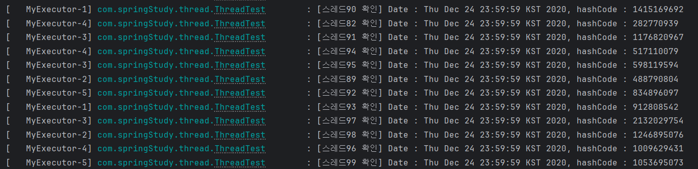

# Spring Bean Scope 와 Life Cycle

# `Bean 의 스코프`

보통 스코프는 공간적인 범위를 나타내는데에 사용되지만, Spring Bean Scope 의 경우 시간과 관련이 있다.

`스프링 빈 스코프`란, 스프링 빈 객체가 생성된 시간부터 소멸되기까지의 기간을 의미한다. 
보통 빈 객체는 `ApplicationContext`가 생성될 때 생성되고 종료될 때 소멸되지만, 
스코프를 설정하여 그 생성 및 소멸 기간을 다르게 설정할 수 있다. 이를 위해 Spring은 6 가지의 스코프를 제공한다.

## `빈 스코프`
1. singleton : 기본값으로 ApplicationContext의 시작과 끝을 같이한다. 스프링 빈에 단 1 개의 객체만 생성하고
    이 객체를 여러 곳에 의존성 주입한다.
2. prototype : 의존성 주입을 할때마다 새로운 객체를 생성하여 주입한다. 따라서 컨테이너에 여러 객체가 존재할 수 있다. 
3. request : Web 전용. HTTP 요청 처리를 할 때마다 새로운 객체를 생성한다.
4. session : Web 전용. HTTP session 처리를 할 때마다 새로운 객체 생성
5. application : Web 전용. Servlet 컨텍스트와 대응하는 새로운 객체를 생성
6. Websocket : Web 전용. Web Socket Session과 대응하는 객체 생성.

### Singleton 에 대해서...
사실 싱글톤 객체란, JVM 내의 단 1개의 유일한 객체만 두고 이를 참조하는 것을 말한다.
즉 JVM 내에 해당 객체가 여러개가 있으면 싱글톤이라고 말할 수 없다. 
하지만 Spring Bean에서의 singleton은 그 의미가 살짝 다르다고 볼 수 있다.  

Spring Bean의 singleton은 빈 컨테이너 내에서 유일한 객체를 의미하는 것이지, JVM 전체를 기준으로 유일하다고 말하기는 어렵다.
빈 컨테이너에 유일한 객체를 생성하였지만, 의존성 주입을 하지 않고 new를 사용해서 새로운 객체를 만들면 JVM 내에는 여러 객체가 존재하기 때문이다.

singleton은 스프링 빈 컨테이너에 유일하게 존재하는 객체라고 생각하자.


## `빈 스코프 사용법`
```java
@Bean
@Scope("singleton")
public SpringObject springObject() { /* ... */  }

@Bean
@Scope("prototype")
public SpringPrototype springPrototype { /* ... */ }
```

나머지 웹에서 사용하는 빈 스코프 애너테이션은 아래와 같이 사용하면 된다.

- request : @RequestScope, @Scope("request")
- session : @SessionScope, @Scope("session")
- application : @ApplicationScope, @Scope("application)
- websocket : @Scope("websocket")

---

# `singleton Bean의 멀티스레드`

singletone Bean 은 하나의 객체만을 두고 사용하기 때문에 여러 상위 모듈에서 동일한 객체를 가져온다.
따라서 멀티 스레드 환경에서 동시에 singleton 객체를 가져올 경우 스레드 안전을 고려하여 코드를 작성해야한다.

멀티 스레드 환경에서, 싱글톤 빈을 공유하여 발생하는 문제를 예제롤 통해 알아보자.


```java

@Slf4j
@SpringBootApplication
public class ThreadTest {

    public static void main(String[] args) throws InterruptedException, ParseException {
        ConfigurableApplicationContext applicationContext = SpringApplication.run(ThreadTest.class, args);

        // 스레드 설정된 빈 가져오기
        ThreadPoolTaskExecutor taskExecutor = applicationContext.getBean(ThreadPoolTaskExecutor.class);

        final String dateString = "2020-12-24T23:59:59.-08:00";


        for (int i=0; i<100; i++) {
            int finalI = i;
            taskExecutor.submit(() -> {
                try {
                    DateFormatter formatter = applicationContext
                            .getBean("singletonDateFormatter", DateFormatter.class);

                    log.info("[스레드{} 확인] Date : {}, hashCode : {}", finalI,
                            formatter.parse(dateString, new Locale("hi")), formatter.hashCode());
                } catch (Exception e) {
                    log.error("[스레드{} 에러] 발생", finalI, e);
                }
            });
        }

        TimeUnit.SECONDS.sleep(5);
        applicationContext.close();

    }

    @Bean(name = "singletonDateFormatter")
    public DateFormatter singletonDateFormatter() {
        return new DateFormatter("yyyy-MM-dd'T'HH:mm:ss");
    }

}
```
```java
public class DateFormatter implements Formatter<Date> {
    private SimpleDateFormat sdf;

    public DateFormatter(String pattern) {
        if (StringUtils.isEmpty(pattern)) throw new IllegalArgumentException("패턴이 비어있습니다.");

        this.sdf = new SimpleDateFormat(pattern);
    }

    public String of(Date target) {
        return sdf.format(target);
    }

    @Override
    public Date parse(String text, Locale locale) throws ParseException {
        return sdf.parse(text);
    }

    @Override
    public String print(Date object, Locale locale) {
        return "";
    }
}
```
위 코드는 스레드 설정을 대기큐 100, 코어 10로 하여 싱글톤을 참조하여 실행하는 코드이다.
싱글톤 (singletonDateFormatter)의 내부에는 sdf라는 필드가 존재함에 초점을 두고 멀티 스레드를 실행시킨다고 생각해보자.

`실행 결과`


결과를 보면, 멀티스레드에 안전하지 않다는 것을 알 수 있다.

이유는 동일한 Bean을 참조하면서, 멀티 스레드에 안전하지 않은 parse 메서드를 사용했기 때문이다.

조금더 구체적으로 파고들어가 보자.


에러 라인 중에, `at java.base/java.text.DigitList.getDouble(DigitList.java:169) ~[na:na]` 을 보자.

```java
    public final double getDouble() {
        if (count == 0) {
            return 0.0;
        }

        StringBuffer temp = getStringBuffer();
        temp.append('.');
        temp.append(digits, 0, count);
        temp.append('E');
        temp.append(decimalAt);
        return Double.parseDouble(temp.toString());
    }
```

위 코드에서 에러가 발생하였다. temp 변수는 지역변수이므로 스레드에 안전한 변수이다.
하지만 temp가 참조하는 getStringBuffer()는 스레드에 안전하지 않을 수도 있다. 스레드 전역에서 공유하는 객체일 수도 있기 때문이다.
getStringBuffer()를 봐보자.

```java
    private StringBuffer tempBuffer; // class private 필드

    private StringBuffer getStringBuffer() {
        if (tempBuffer == null) {
            tempBuffer = new StringBuffer(MAX_COUNT);
        } else {
            tempBuffer.setLength(0);
        }
        return tempBuffer;
    }
```

tempBuffer라는 클래스 필드를 공유한다. 
즉, 하나의 클래스 당 1개의 tempBuffer를 사용하고, 
tempBuffer가 생성되어있을 경우에는 값을 초기화하여 사용한다.

여기에서 `문제`가 발생한다.

A스레드와 B스레드가 동시에 작업한다고 해보자.
A 스레드에서 tempBuffer에 값을 쓰면서 저장하는 중에
B 스레드에서 tempBuffer를 초기화했다고 생각해보자.

A 스레드에서 는 정확한 형식으로 tempBuffer에 값이 입력되어있어야 하지만,
중간에 B스레드가 삭제를 했기때문에 형식이 정확하지 않는 문제가 발생한다.
이로인해서 Format 에러가 발생하는 것이다.

간단하게 말하자면 데이터를 쓰고있는 도중에, 다른 스레드가 데이터를 덮어써버리면서 충돌이 발생하는 것이다.

`ERROR : java.lang.NumberFormatException: multiple points`
multiple points 인것을 보면, 형식상 '.'이 1개만 있어야하는데, 스레드 A와 B가 동시에
쓰다보니 '.'이 2개 들어가서 문제가 발생한 듯 하다.

따라서 멀티 스레드 환경에서는 반드시 `스레드 안전`을 고려해야한다.

---
### `스레드 안전한 코드`

스레드 충돌이 발생하지 않도록 하려면 어떻게 해야할까? 크게 3가지 방법이 있을 듯하다.

1. 클래스 필드 sdf에 값을 할당하는 것이 아니라, 메서드에서 바로 return 하도록 바꾸기
2. 이미 스레드 안전 처리가 되어있는 Class를 사용할 것. (DateTimeFormatter 클래스)
3. prototype 스코프로 매번 빈 객체를 생성해서 컨테이너에 넣는 것

여기에서는 마지막 `protytype`으로 스코프를 변경하여 해결해보자.

```java
    @Bean(name = "singletonDateFormatter")
    @Scope("prototype")
    public DateFormatter singletonDateFormatter() {
        return new DateFormatter("yyyy-MM-dd'T'HH:mm:ss");
    }
```

이제 매번 빈 객체를 주입받을 때마다, 새로운 빈 객체가 컨테이너에 생성된다.

`실행결과`


hashCode를 보면 각 빈 객체가 다른 것을 알 수 있다. 따라서 멀티 스레드 환경에서 충돌없이 실행된다.

항상 싱글톤 객체를 멀티 스레드 환경에서 사용할 경우 `스레드에 안전`하나지 확인하는 습관을 기르도록 하자.


