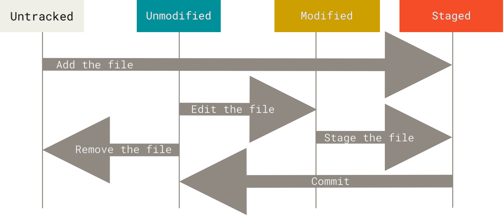

# `git 주요 명령어`

---

## `저장소 만들기`

git 저장소를 만드는 방법은 두 가지이다.
1. 기존 프로젝트를 git 저장소로 만드는 방법
2. 다른 서버에 있는 저장소를 clone으로 가져오는 방법

### 로컬 프로젝트를 git 저장소로 만들기
```
$ git init
```
위 명령어를 사용하면 디렉토리에 .git 파일이 생겨 git 저장소를 만들 수 있다.

---

### 다른 저장소를 가져오기
```
$ git clone [주소] 
```
다른 서버의 git 저장소를 복사하여 로컬로 가져온다. 

서버에 있는 거의 모든 데이터를 가져오기 때문에, git 히스토리를 전부 받아온다.

---

## 수정하고 저장하기

git에서 file은 크게 2가지로 나눌 수 있다.
- Untracked
- Tracked

그리고 Tracked는 3가지로 나누어진다.
- Unmodified
- Modified
- Staged



.gitingnore에 저장시켜 반영하지 않는 파일이 `Untracked`이고,
수정한 상태를 `Modified`, add를 통해 stage에 올린 파일들을 `staged` 라고 한다.
---

### add
```
$ git add
```
add는 다음 상황에서 사용한다.
- Untracked 파일을 Tracked 시킬 때
- modified 상태의 파일은 Staged 상태로 변환할 때
- Merge할 때 충돌 난 파일을 Resolve 상태로 만들 때

**간단하게 commit 하기 위한 명단에 올린다** 라고 생각하면 편하다.
---

### commit
```
$ git commit [filename]
```

staged에 있는 파일들을 commit하여 저장소에 저장한다.

**옵션**
- -a : Tracked 상태의 파일 전체를 자동으로 staging 에 넣어 커밋한다.
- -m : 메시지를 인라인으로 입력한다.

---

### staging 에서만 파일 제거하기

작업을 하다 보면 staging에서만 제거하고 워킹 디렉토리에서는 남겨두고 싶을 때가 있다.

실수로 .gitignore에 추가하지 않고 commit 해버린 경우인데, 다음과 같이 해결이 가능하다.

```
$ git rm --cached [filename]
```

하드디스크에 있는 파일은 그대로 두고 git만 추적하지 못하도록 만든다.

---
### 복구하기

#### 이전 commit 내용 수정하기
```
$ git commit -- amend 
```
위 명령어를 사용하면 현재 stageing 에 있는 파일들을 사용하여
이전에 commit 했던 내용에 덮어 쓴다.

커밋시에 실수로 파일을 빠뜨리거나 메시지를 잘못 적었을 때 유용하다.

### 파일을 Unstage로 변경하기
```
$ git reset HEAD <filename>
```

파일을 실수로 add 하여, staging 상태에서 제거하고 싶을 때 사용한다.

추가적으로 
--hard 옵션을 사용하면 워킹 디렉터리 파일까지 같이 수정이 되므로 조심하자.

### 파일을 이전 commit 상태로 되돌리기 
```
$ git checkout -- <file>
```
파일을 최근 commit 한 내용으로 되돌리는 명령어이다.
하지만 변경한 내용이 모두 없어지므로, 가능하면 Stash나 Branch를 사용하는 것이 좋다.

---

## 원격 저장소

### remote 저장소 확인하기
```
$ git remote -v
$ git remote show [barnch 이름]
```
둘중에 아무거나 사용하면 된다.

### remote 저장소 추가하기
```
$ git remote add [이름] [url]
```

원격 저장소를 url 대신에, `이름` 으로 사용할 수 있다.

### pull / fetch
```
$ git fetch [remote-name]
```
원격 저장소에서 데이터를 가져오는 명령어이다.
저장소를 clone 하면 자동으로 원격 저장소를 `origin`이라는 이름으로 추가한다.

**fetch / pull 차이점**
- fetch : clone 한 서버에서 데이터를 가져오고 수동으로 Merge 해야함
- pull : clone 한 서버에서 데이터를 가져오고 해당 데이터를 자동으로 현재 코드와 Merge 처리한다

- clone : 자동으로 로컬의 master 브랜치가 remote의 master 브랜치를 추적하도록 한다.


**clone vs fetch/pull**
- `clone`은 현재 로컬에 git 이 없을 때, 원격 서버에서 프로젝트를 가져오기 위해서 사용하고,
- remote fetch, pull은 현재 로컬에 git이 있고 이를 merge하고 싶을 때 사용한다.

---

### push
```
$ git push [remote 저장소 이름] [브랜치 이름]
```
다음 조건을 만족할 때, 이 명령은 원격 저장소에 push 할 수 있다.
- Clone한 remote 저장소에 쓰기 권한이 있어야함
- 여러명에서 작업할때, 다른 사람이 Push를 한 후에 Push하려고 하면 Push 할 수 없다.

2번의 경우에는 push된 작업을 먼저 가져와서 merge 한 후에 push 할 수 있다.

---

### 이름 바꾸거나 삭제하기
```
$ git remote rename [기존 이름] [새로운 이름]

$ git remote rm [삭제할 remote 저장소]
```


