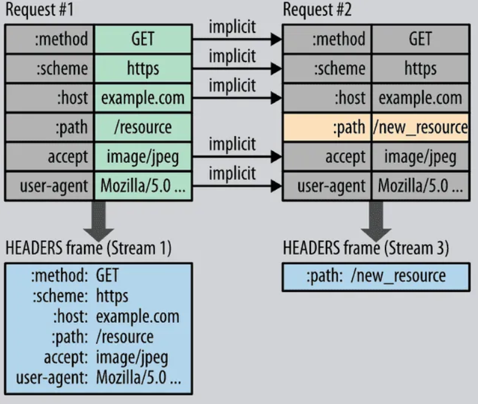

# 2. HTTP

## 2.1 HTTP/0.9

HTTP1.0 이전에 사용하던 HTTP를 지칭하는 버전이다.

- 초기에는 GET 메서드만 유일했음

```bash
// 요청
GET /mypage.html
```

```bash
// 응답
<html>
  A very simple HTML page
</html>
```

초기에는 헤더가 없이, 순수하게 요청내용과 응답 내용만 전달하였다. 응답 상태도 없고, 어떤 데이터를 전달했는지도 없는데, 이런 저런 사항들을 추가하며 문서화를 하여 HTTP/1.0이 탄생하였다.

## 2.2 HTTP/1.0

0.9에서 헤더를 추가한 형태가 HTTP/1.0이다.

```html
GET /mypage.html HTTP/1.0
User-Agent: NCSA_Mosaic/2.0 (Windows 3.1)
```

```html
200 OK
Date: Tue, 15 Nov 1994 08:12:31 GMT
Server: CERN/3.0 libwww/2.17
Content-Type: text/html
<HTML>
A page with an image
  
</HTML>
```

응답데이터에는 상태 코드, 버전 정보, 문서 타입이 추가되었다.

이를 통해 사용자가 응답을 받고 어떻게 처리할지를 명확하게 알 수 있게 되었다.

그런데 이 모든건 기능들을 문서로 정리하였을 뿐이고 표준 공식은 아니었는데,..

## 2.3 HTTP/1.1

HTTP의 진짜 표준이다. 당시의 1.0 버전의 몇가지 문제들을 개선하며 공식 표준으로 자리매김하게 되었다.


그렇다면 어떤 문제점들을 개선했을까?

HTTP/1.0의 경우에는 데이터를 전송할때마다 새로운 TCP 연결(3way-handshake)를 해야했다. 이로인해서 HTML, js, img 등의 파일들을 받는 속도가 느린 문제가 있었다. 이를 개선하기 위해서 HTTP/1.1은 keep alive라는 TCP 연결 유지기법을 도입하였다. 파일을 요청/응답할때마다 연결을 하는 것이 아닌 연결상태를 계속해서 유지시켜둠으로써 데이터를 빠르게 주고 받을 수 있게 되었다.

또한 기존 1.0 버전에서는 응답이 도달해야만 다음 요청을 보낼 수 있는 구조였다. 이로 인해 요청이 대기하는 시간이 많았는데, 1.1버전에서는 pipelining을 도입하여 응답을 받지 않았어도 요청을 전송할 수 있게 되었다.

다만 실제로 HTTP1.1에서는 응답 순서의 문제로 인해서 pipelining을 지원하지 않는다. 1개의 TCP연결에서 요청을 여러개 날릴 경우, 반드시 서버는 요청받은 순서대로 클라이언트에게 응답을 전달해줘야한다. 이로 인해서 성능이 오히려 느려질 수 있는데 이를 `HOL Blocking`이라고 한다. 예를 들어 a, b, c 순서대로 요청을 보냈는데, a의 응답 데이터가 클 경우 상대적으로 작은 b, c 의 데이터를 받는데에 오랜 시간이 소요되기 때문이다. 대신에 현대 브라우저는 TCP를 여러개를 병렬적으로 연결하여, 데이터 여러개를 병렬적으로 요청하고 응답할 수 있는 구조를 갖는다.

```html
브라우저 소켓들                 서버
50001 → 443  ───────────────►   example.com
50002 → 443  ───────────────►
50003 → 443  ───────────────►
50004 → 443  ───────────────►
50005 → 443  ───────────────►
50006 → 443  ───────────────►
```

위와 같은 방식으로 연결할 경우, 각 병렬 TCP 연결간의 요청순서와 응답 순서가 중요하지 않기 때문에 성능이 향상된다.

## 2.4 HTTP/2

Google의 SPDY가 HTTP/1.1의 성능상의 문제점을 해결하고 속도를 개선한 HTTP/2를 개발하였습니다.


기존 HTTP의 문제는 `반드시 요청을 보낸 순서대로 응답` 을 해야한다는 것이다. 그리고 이 문제로 인해서 HOL 블로킹 현상이 나타났던 것이므로 이를 해결하려고 하였다.

### 2.4.1 HTTP/1 의 문제 해결

HTTP2는 응답 순서가 고정되어야하는 문제를 각각의 응답이 어떤 요청에 대한 응답인지를 헤더에 작성하여 해결하였다. 이를 통해 하나의 TCP연결에서 여러 개의 데이터 스트림을 전송하는 `멀티플렉싱`(Multiplexing)을 가능하게 하였다. 그래서 HTTP2에서는 다음과 같이 데이터가 섞여 들어올 수 있다.


모든 요청과 응답에는 헤더가 같이 전송이 된다. 여러 조각으로 작게 쪼갠 데이터에도 예외가 아닌데, 이로 인해서 잘게 쪼개 데이터들의 헤더가 중복되어 전달되는 문제가 있다.

HTTP2에서는 다음 2가지로 이를 해결하였다.

- 불필요한 헤더 정보 제외
- 헤더 필드 압축 (HPACK)
  
  


  허프만 코딩 기법(달라지지 않는 부분은 전송하지 않는 기법)을 사용하여 오버헤드를 최소화함.


### 2.4.2 HTTP/2 데이터 프레임 구조

```html
+----------------------------------------------------+
| Length(24) | Type(8) | Flags(8) | R | StreamID(31) |
+----------------------------------------------------+
|                   Frame Payload                    |
+----------------------------------------------------+
```

추가적으로 HTTP/2 는 TLS 가 필수적이어서 HTTPS 를 통한 통신을 해야한다.


### 2.4.3 HTTP/2 의 문제점

TCP 통신은 패킷이 손실되었을때, 이를 다시 요청하는 작업을 진행하게 된다. 이때 처리 방식이 HTTP/1.1과 HTTP/2.0이 다른데, 각각 이해해보자.

TCP 통신에서는 패킷이 손실되면 서버에 해당 패킷을 다시 요청한다. 이때, 손실된 패킷 이후의 패킷들은 잠시 OS 커널 버퍼에 잠시 넣어두고 해당 패킷이 다시 들어올 때까지 패킷들을 상위로 올리지 않게 된다.

**`HTTP 1.1`**

HTTP1.1 의 경우에는 여러 TCP가 병렬적으로 연결되어있기 때문에 하나의 TCP 라인에서 패킷이 손실되어도 다른 라인에 영향을 끼치지 않는다. TCP라인이 1~6까지 있고, 1번에서 패킷이 손실되었다고 해보자.

```html
브라우저 소켓들                 서버
50001 → 443  ─────  X ──────►   example.com
50002 → 443  ───────────────►
50003 → 443  ───────────────►
50004 → 443  ───────────────►
50005 → 443  ───────────────►
50006 → 443  ───────────────►
```

그러면 1번 라인에 들어오는 패킷들을 상위로 올려지지 않고 커널버퍼에 저장되어 대기상태가 된다. 하지만 나머지 라인들은 패킷들을 받는대로 상위로 올리게 되므로 큰 영향을 끼치지 않게 된다.

**`HTTP 2.0`**

HTTP 2.0은 하나의 연결라인에서 멀티플렉싱으로 처리하는데, 이때도 마찬가지로 손실된 패킷이 다시 들어올 때까지 다른 패킷들을 상위로 올리지 않게된다. 문제는 손실된 stream 의 패킷 뿐만 아니라, 다른 stream의 패킷들도 올려지지 않아서 모든 패킷에 대해 정체가 생기게 된다. 따라서 패킷 손실이 되었을 때에는 HTTP1.1 보다 느려질 수 있다.

이러한 패킷 손실에 따른 성능 저하문제를 해결하기 위해서 HTTP/3이 개발되었다.

## 2.5 HTTP/3

HTTP/3는 **TCP의 구조적 한계** — 손실된 패킷이 오기 전까지 OS 커널이 뒤 패킷도 보류하는 **HOL blocking 문제** 때문에 등장했다.

이를 해결하기 위해 **UDP 위에 QUIC이라는 새로운 전송 계층**을 만들었고, 이 QUIC은 TCP의 기능(신뢰성·혼잡제어)을 재구현하면서 **스트림 단위 독립 전송**을 지원한다.

즉, HTTP/3는 단순히 “UDP 위 TCP”라기보다는 **TCP의 한계를 보완한 새로운 전송 계층**이라고 보는 게 정확하다.

가장 좋은 자료 : https://yozm.wishket.com/magazine/detail/1686/

출처 : https://brunch.co.kr/@swimjiy/39

출처 : https://developer.mozilla.org/ko/docs/Web/HTTP/Guides/Evolution_of_HTTP?utm_source=chatgpt.com